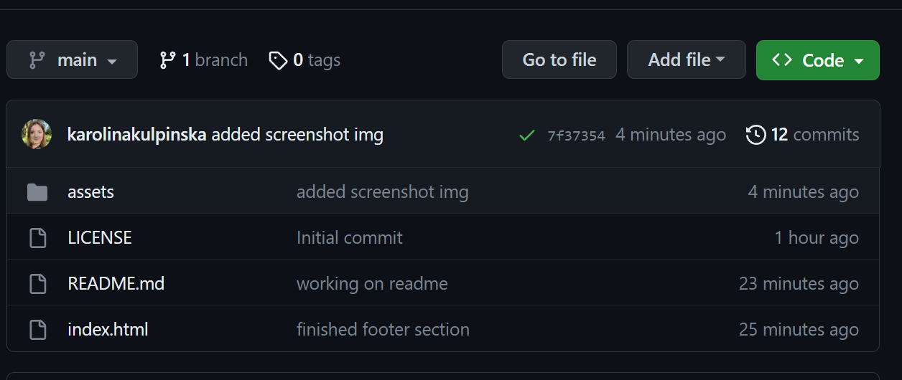

# Financial Analysis

## Description

In this challenge, I used my newfound JavaScript skills to complete the required activity. I was tasked with creating code for analyzing the financial records of a company. I have been provided with a financial dataset composed of arrays with two fields, Date and Profit/Losses as well as instructions to complete the challenge. I had 
My task was to write JavaScript code that analyzes the records to calculate each of the following:

* The total number of months included in the dataset;
* The net total amount of Profit/Losses over the entire period;
* The average of the **changes** in Profit/Losses over the entire period;
  * Track what the total change in Profit/Losses are from month to month and then find the **average**;
  * Round the average to the nearest 100th;
* The greatest increase in Profit/Losses (date and amount) over the entire period;
* The greatest decrease in Profit/Losses (date and amount) over the entire period;
* The final code should print the analysis to the console.

I used variables to store data and arithmetic comparisons to perform calculations. Before tackling this task I used pseudocode to structure the required steps. Lastly I logged all the data to the console in the browser as per challenge requirements. 
During the process of building this application I had to do a lot of research to find solutions and use computational thinking to recognise recurring patterns.

I've also made sure that the application:
* loads with no errors;
* is deployed at live URL;
* resembles the example functionality provided in the challenge instructions.

As well as repository:
* follows best practices for file structure and naming conventions;
* follows best practices for variable naming conventions, indentation, quality commentary, etc;
* contains multiple descriptive commit messages, contains quality README file with description, screenshot, and link to deployed application.

Link to deployed application: https://karolinakulpinska.github.io/console-finances/

## Resulting analysis should look similar to the following
```text
  Financial Analysis 
  ----------------
  Total Months: 86
  Total: $38382578
  Average Change: -2315.12
  Greatest Increase in Profits/Losses: Feb-2012 ($1926159)
  Greatest Decrease in Profits/Losses: Sep-2013 ($-2196167)
  ```

## Screenshot of the final result


## Installation

Please follow the steps below to access code and install the project:

1. Access https://github.com/karolinakulpinska/console-finances
2. Above the list of files, click on green 'Code' button.

3. Copy the URL of the repository.
- To clone the repository using HTTPS, under "HTTPS", click two files button.

- To clone the repository using an SSH key, including a certificate issued by your organization's SSH certificate authority, click SSH, then click two files button.
- To clone a repository using GitHub CLI, click GitHub CLI, then click two files button.
4. Open Terminal/Git Bash.
5. Change the current working directory to the location where you want the cloned directory.
6. Type `git clone`, and then paste the URL you copied earlier.

```
$ git clone https://github.com/karolinakulpinska/console-finances.git
```
7. Press Enter to create your local clone.

```
$ git clone https://github.com/karolinakulpinska/console-finances.git
> Cloning into `console-finances`...
> remote: Counting objects: 10, done.
> remote: Compressing objects: 100% (8/8), done.
> remove: Total 10 (delta 1), reused 10 (delta 1)
> Unpacking objects: 100% (10/10), done.

```

## Usage

The data stored in a variable `var = finances` (Date and Profit/Losses) can be replaced following the usage of appropriate type of data (`string` for the date and `number` for the value). To access the data open the `script.js` file in any code editor (i.e. Visual Studio Code) after cloning the repository to your local machine (see: 'Installation' above). Then, after performing desired changes, open the `index.html` file in Google Chrome browser, right-click anywhere on the screen and choose 'Inspect' from the dropdown menu. The tabs on top of the window will have an option 'Console' which shows results of the updated financial analysis as shown on the screenshot of the final result (see above).

## Licence

MIT License

Copyright (c) 2023 Karolina Kulpinska 

Permission is hereby granted, free of charge, to any person obtaining a copy
of this software and associated documentation files (the "Software"), to deal
in the Software without restriction, including without limitation the rights
to use, copy, modify, merge, publish, distribute, sublicense, and/or sell
copies of the Software, and to permit persons to whom the Software is
furnished to do so, subject to the following conditions:

The above copyright notice and this permission notice shall be included in all
copies or substantial portions of the Software.

THE SOFTWARE IS PROVIDED "AS IS", WITHOUT WARRANTY OF ANY KIND, EXPRESS OR
IMPLIED, INCLUDING BUT NOT LIMITED TO THE WARRANTIES OF MERCHANTABILITY,
FITNESS FOR A PARTICULAR PURPOSE AND NONINFRINGEMENT. IN NO EVENT SHALL THE
AUTHORS OR COPYRIGHT HOLDERS BE LIABLE FOR ANY CLAIM, DAMAGES OR OTHER
LIABILITY, WHETHER IN AN ACTION OF CONTRACT, TORT OR OTHERWISE, ARISING FROM,
OUT OF OR IN CONNECTION WITH THE SOFTWARE OR THE USE OR OTHER DEALINGS IN THE
SOFTWARE.
